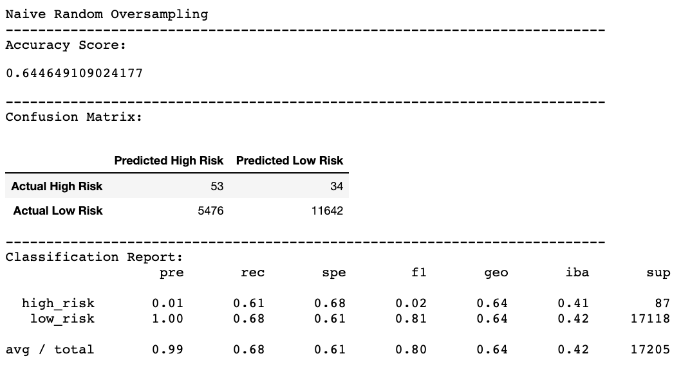
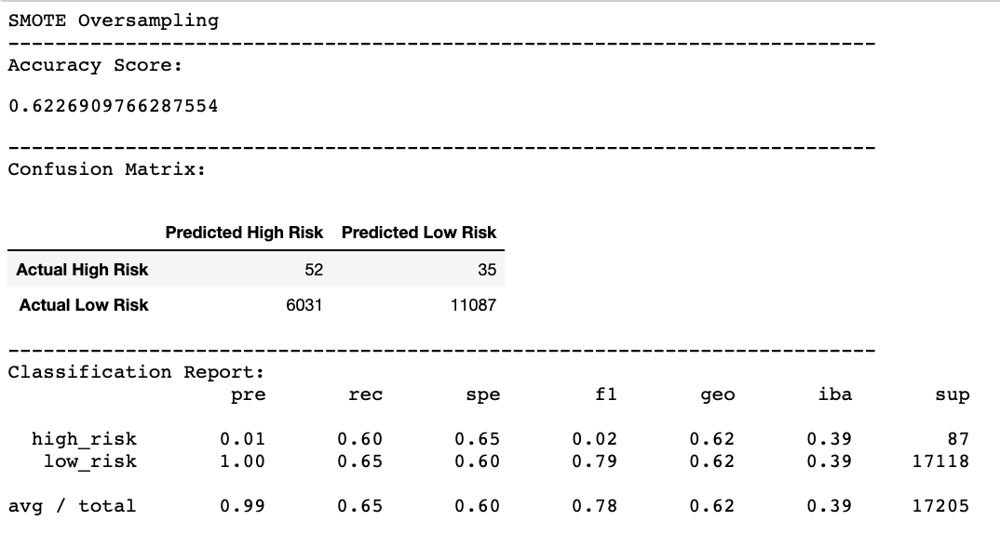
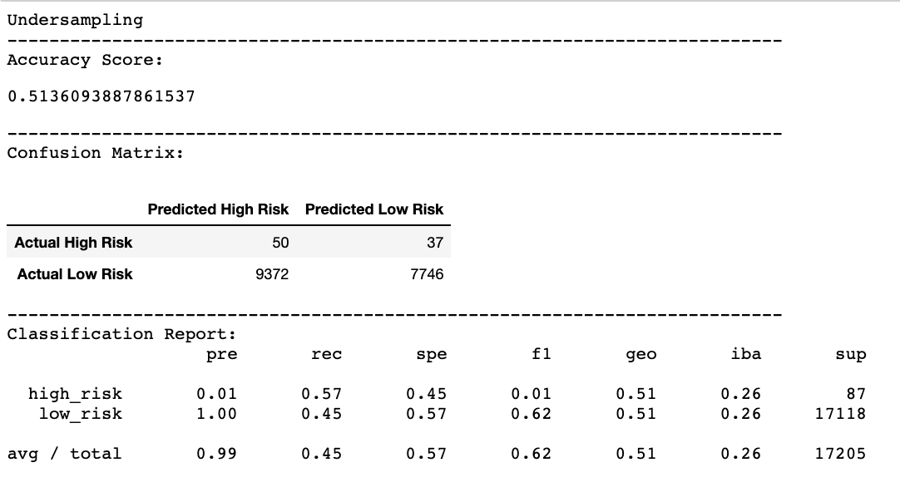
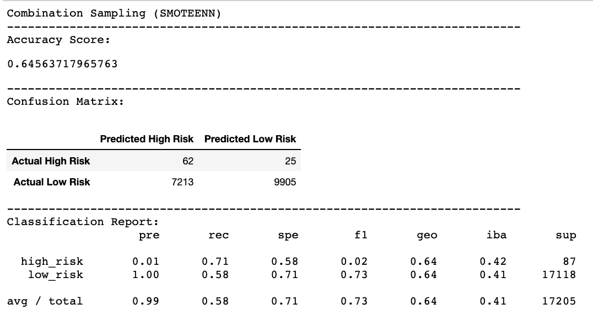
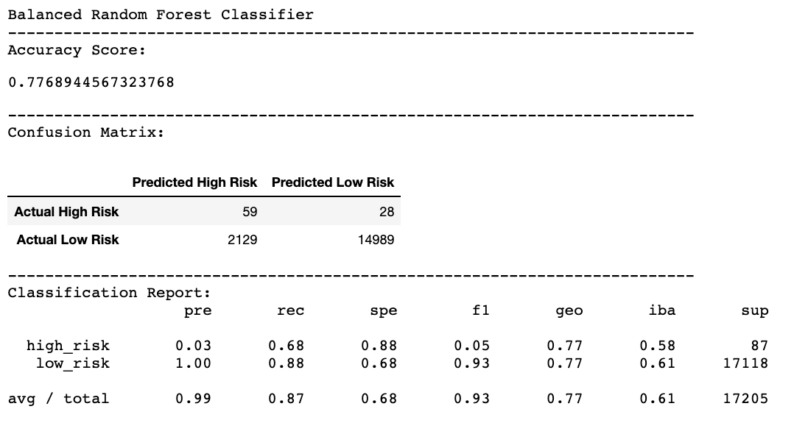
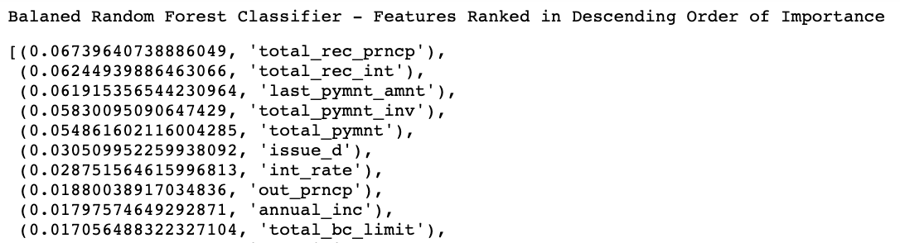
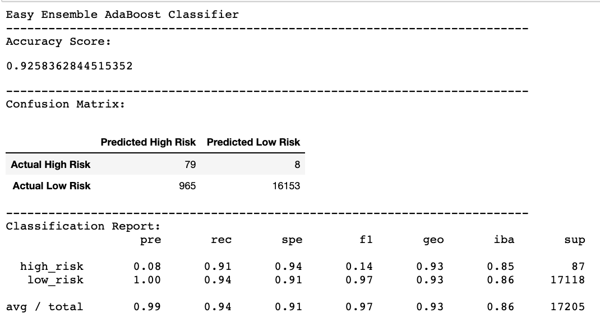
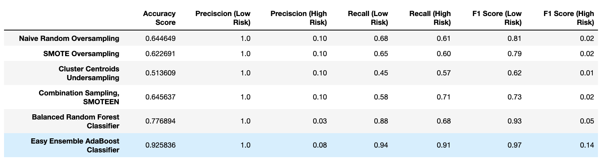

# Credit_Risk_Analysis
Comparing sampling techniques to classify low and high risk loan applicants.

## Overview
Credit card companies must evaluate new customer credit applications to assess the applicant's credit risk. In general, an applicant that has a lower likelihood of paying back their full loan or credit amount is higher risk and less likely to be approved for a new credit card. 

There are many factors that can go into predicting an applicant's likelihood to pay off their credit card balance. Some of these are fairly straightforward - like previous loan approvals, home ownership, or credit score, however there may be other less obvious factors that can be helpful in predicting credit risk. 

The goal of this project is to build a classification model that can predict if an applicant is likelky to have low or high credit risk. The credit card company can use this information to determine whether or not an applicant should be approved. 

First, we will be using different sampling methods from the Scikit-learn library to investigate the impact of sampling technique on model performance using logistic regression. We will then build two ensemble classifiers (BalancedRandomForestClassifier and EasyEnsembleClassifier) and compare the performance from all six models to identify which performs the best. Our criteria for assessing model performance are:

    1. Accuracy Score - a measure of how likely a model is to label all predictions correctly.
    2. Preciscion - a classifier's ability to accurately label samples and minimize false positives or negatives
    3. Recall (Sensitivity) - a classifier's ability to find all the positive or negative samples. In this scenario, the higher the recall, the less chance there is that a high risk applicant will be classified as low risk and vice versa.

## Results

#### *Naive Random Oversampling (ROS)*
The first model was trained with data sampled using the naive random overampling technique, which increases sampling from the minority class until both classes are balanced.

* **Balanced Accuracy Score**: This model accurately predicts credit risk 64.4% of the time when the minority class is balanced by oversampling.

* **Preciscion**: The precision of this model is 0.01 for high risk and 1.00 for low risk applicants. This means that 100% of the predicted low risk applicants are actually low risk, but only 1% of the predicted high risk applicants are actually high risk. 

* **Recall**: The recall of this model is 0.61 for high risk, and 0.68 for low risk applicants. This means that 61% of high risk applicants are classified as high risk and 68% of low risk applicants are classified as low risk.

#### *SMOTE Oversampling*
The data for our second model was selected using the SMOTE oversampling technique. This method also oversamples from the minority class to balance the classes, however with SMOTE, the distance between neighboring datapoints is taken into account to generate synthetic data.

* **Balanced Accuracy Score**: The SMOTE oversampling model has a slightly lower accuracy score than Naive ROS. This model makes accurate predictions of credit risk 62.2% of the time.

* **Preciscion**: SMOTE oversampling gives the same model preciscion score as the model trained with Naive ROS (1.00 and 0.01 for low and high risk respectively). Both models inaccurately classify 90% of high risk applicants as low risk.

* **Recall**: The recall for this model is slightly worse than the recall from the model trained with Naive ROS. 60% of high risk applicants are categorized as high risk and 65% of low risk applicants are classified as low risk.

#### *Undersampling (Cluster Centroids)
The data for the third model was sampled using the Cluster Centroid undersampling technique. This method generates synthetic data points from the majority class and then undersamples the majority class to match the size of the minority class. 

* **Balanced Accuracy Score**: Undersampling the majority class gives the lowest accuracy score so far at 51.3%, which is only slightly better than random chance.

* **Preciscion**: The precision scores for this model are the same as the first two models.

* **Recall**: THe recall scores for this model are also the lowest thus far. Only 45% of high risk applicants and 57% of low risk applicants are classified correctly. If this model were used to predict risk and approve/deny accordingly, this model would classify more than half of low risk applicants as high risk and nearly half of high risk applicants as low risk.

#### *Combination Sampling (SMOTEEN)*
The fourth model was trained with data sampled with the SMOTEEN technique. This method oversamples from the minority class, and outliers are removed from the majority class to undersample. This balances the classes while reducing outliers that would skew the sythetic values generated by neighbor distance.

* **Balanced Accuracy Score**: This model accurately predicts credit risk 64.5% of the time when the classes are balanced by combination over and undersampling.

* **Preciscion**: The precision scores for this model are the same as the first three models.

* **Recall**: This model correctly classifies 71% of high risk applicants and 58% of low risk applicants. This model has the best sensitivity for detecting high risk applicants out of all four sampling models. 

#### *Balanced Random Forests Classifier*
We next tried two ensembles models, which improves overall model performance by combining multiple models to help improve accuracty and decrease variance. The Random Forests Classifier is composed of several small decision trees created from random sampling. By using the Balanced Random Forests, we oversample from the minority class to balance the classes.

* **Balanced Accuracy Score**: This model accurately predicts credit risk 77.6% of the time when multiple models are combined and the minority class is balanced by oversampling.

* **Preciscion**: This model has the highest precision for classifying high risk applicants compared to models built from sampling techniques alone, but with a precision score of 0.03 this model still classifies 97% of high risk applicants as low risk. This model has the same preciscion score for classifying low risk applicants as the previous models (100%).

* **Recall**: This model correctly identifies 88% of low risk applicants as low risk, and 68% of high risk applicants as high risk. Though the recall score for high risk applicants is 3% lower than the recall score from the SMOTEENN model, the high recall score for low risk makes this ensemble model a better performer than models built from sampling techniques alone.

* **Ranked Features**: One of the benefits of the balanced random forests model is that we can rank features by importance, or the weight the model gives each feature in predicting outcomes. The top five features that were identified by the model as good predictors of credit risk were total recorded principle payment (or the payment toward the original amount of the loan), total recorded interest payment (or the amount of each payment that goes toward interest), last payment amount, total payment invoice, and total payment. Dropping the least important features from the training data may improve model performance.

#### *Easy Ensemble Classifier with Adaptive Boosting (AdaBoost)*
The final model that we generated for this analysis was built using an easy ensemble classifier with adaptive boosting, or AdaBoost. Using AdaBoost, a model is trained and then evaluated. The errors of the first model are given extra weight when the subsequent model is trained and so on until the error rate is minimized.  

* **Balanced Accuracy Score**: This model accurately predicts credit risk 92.5% of the time when multiple models are trained sequentially on a balanced dataset to minimize error. 

* **Preciscion**: The precision score for correclty identifying high risk applicants is 8%, which is the highest for all 6 models. The preciscion score for low risk applicants is 100%, which is the same as the other models.

* **Recall**: In this model, 91% of high risk and 94% of low risk applicants were correctly identified, which is the highest recall score of all the models. 

## Summary

Above is a summary of the the balanced accuracy, precisicon, recall, and f1 scores for all 6 models. In terms of overall performance, the Cluster Centroid Undersampling model performed the worst, followed next by the SMOTE oversampling model, and Naive Random Oversampling models. In general, the ensemble models (Balanced Random Forests and AdaBoost) performed better with a higher precision and recall rates for correctly predicting high risk credit applicants. 

The AdaBoost Ensemble model outperformed all other models in terms of correctly identifying high-risk applicants. Therefore, we would reccomend using this model to predict credit risk. The caveat to this model is a high false positive rate. Of the applicants that are predicted to be high risk, only 8% of them will actually be high risk. In this scenario though, it is better for the model to have greater senstivity than precision because the credit card company would rather wrongly classify low risk applicants as high risk, than have high risk applicants classified as low risk thus approving them for a credit card or loan they are unable to repay. 